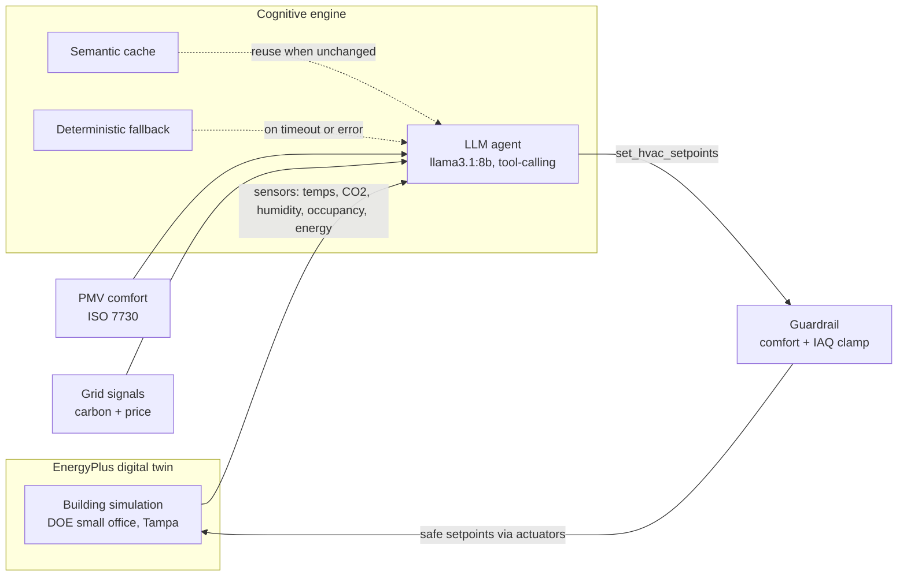
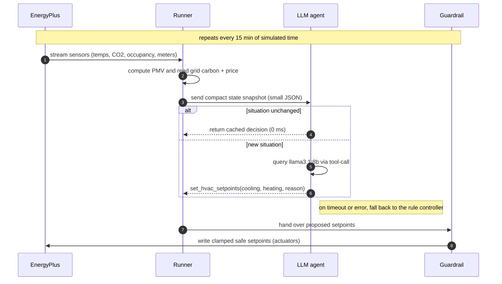

# Eco-Loop Building Agent - System Architecture

An autonomous, closed-loop control system that pairs a **physics-based EnergyPlus
simulation** with an **open-source LLM (llama3.1:8b)** to run a building's HVAC in
real time — sensing, reasoning, and injecting supervisory setpoints back into the
live simulation with no human in the loop.

---

## 1. The closed loop at a glance



*Read it as a loop:* the twin streams sensors to the agent; the agent proposes
setpoints by calling a tool; the guardrail clamps them into the safe comfort/IAQ
envelope; the safe setpoints are injected back into the twin. Then it repeats.

### A single decision, step by step



The **same tools** are also published over the **Model Context Protocol**
(`mcp_server/server.py`) so any MCP client can operate the building.

---

## 2. Feedback: EnergyPlus → AI (sensing)

We use the EnergyPlus **Python Runtime API** (`pyenergyplus`), not file editing, so
control is genuinely *in the loop*. Two callbacks are registered per run:

| Calling point | Purpose |
|---|---|
| `callback_begin_system_timestep_before_predictor` | read sensors → decide → **inject setpoints** before the zone is solved |
| `callback_end_zone_timestep_after_zone_reporting` | accumulate meters + log the timeseries after the zone is solved |

Every timestep we stream, per zone: mean air temp, mean radiant temp, relative
humidity, **indoor CO₂ concentration (IAQ)**, occupant count, and the live thermostat
setpoints, plus site outdoor temperature and the `Electricity:Building`,
`Electricity:HVAC`, `Cooling` and `Fans` meters. From temp + radiant + RH we compute
**Fanger PMV/PPD (ISO 7730)** in Python — a first-class comfort KPI the agent reasons
about and the guardrail enforces. Indoor CO₂ (enabled via `ZoneAirContaminantBalance`
with the occupants' default generation rate) is the **IAQ** signal: the agent keeps it
under a 1000 ppm target while it saves energy. All accounting is gated to the weather
run period (`kind_of_sim == 3`) so sizing design-days never pollute the numbers.

## 3. Reasoning: the LLM as building operator

Each control interval the runner hands the agent a compact JSON `Snapshot`
(time-of-day, occupancy, outdoor temp, worst PMV, indoor temp, **grid carbon +
price + peak flag**, current setpoints). The agent evaluates it against targets:
occupant comfort (|PMV| ≤ 0.5 goal, ≤ 0.7 hard limit), **indoor air quality (CO₂ <
1000 ppm)**, peak-demand cost, and grid carbon intensity — a genuine multi-objective
trade-off (energy vs cost vs carbon vs comfort vs IAQ).

The LLM responds by **calling a tool** — it never writes code:

```json
set_hvac_setpoints(cooling_setpoint_c=25.5, heating_setpoint_c=20.0,
                   rationale="Occupied peak: float cooling to band top to shed costly load")
```

## 4. Control: AI → EnergyPlus (actuation) + the guardrail

The tool output passes through a **hard Guardrail** before it touches the
simulation:

* Occupied: heating ∈ [20, 22] °C, cooling ∈ [23, 25.5] °C.
* Unoccupied: setback allowed to 15.6 / 29.4 °C.
* Cooling always ≥ heating + 2 °C deadband.

Clamped setpoints are written to the per-zone **`Zone Temperature Control`**
heating/cooling-setpoint actuators via `set_actuator_value`, and re-applied every
timestep so the override holds. This is why energy can never be "saved" by
violating comfort — the physics simply never sees an unsafe setpoint.

## 5. Prompt-engineering strategy

* **Role + numeric constraints in the system prompt.** The operator persona ships
  with the exact comfort bands and the peak-shaving strategy, so the model's
  degrees of freedom are small and safe.
* **Structured tool I/O, not free text.** A JSON-schema tool (`set_hvac_setpoints`)
  forces machine-parseable output; a short one-sentence `rationale` gives us an
  explainability trail without inflating latency.
* **Tiny state payload.** The `Snapshot.to_prompt_dict()` is ~12 fields of rounded
  numbers — enough to decide, small enough to be fast and cache-friendly.
* **Low temperature (0.1).** Control decisions should be near-deterministic.
* **Guardrail as backstop, not as prompt.** We assume the model can err and clamp
  physically, rather than relying on the prompt to be obeyed perfectly.

## 6. Prompt-latency management

A naive design would call the LLM every timestep (~2,000 calls / 2 weeks) — far too
slow. Three mechanisms keep the loop real-time:

1. **Control cadence.** Decisions are throttled to `control.interval_minutes`
   (default 15 min); intermediate timesteps re-apply the held setpoint.
2. **Semantic caching.** We hash the *operating regime* — occupancy, grid-peak
   flag, outdoor-temp bucket (2 °C), comfort-at-risk flag — and only spend an LLM
   call when the regime changes. Over the 2-week run this collapsed 1,008 candidate
   decisions into just 171 real inference calls (837 from cache, 0 fallbacks).
3. **Warm model.** The model is preloaded (`keep_alive: 30m`) so no decision pays a
   cold-start; typical decision latency is a few hundred ms and is logged per call.

## 7. Handling lengthy simulation logs

EnergyPlus emits large `.eso`/`.err`/`.audit` logs. We never feed raw logs to the
LLM. Instead:

* **Sensor data is structured at the source** — read numerically through the API
  and reduced to a small `Snapshot`, so the LLM sees kilobytes, not megabytes.
* **The `.err` file is parsed to a summary** (`get_simulation_errors`): counts of
  warning/severe/fatal plus the first few severe lines. Only that digest is
  surfaced to the agent / self-correction routine.
* **Timeseries are streamed to CSV/Parquet-friendly rows** for the dashboard, kept
  out of the reasoning path entirely.

## 8. Agentic autonomy, self-correction & reliability

* **Autonomy (tool-calling + MCP).** The agent acts only through tools; the same
  tools are exposed over MCP for external agents.
* **Self-correction.** After a run the agent parses `.err`; the self-correction
  routine (`scripts/demo_self_correction.py`) can detect a class of fatal input
  errors, propose a fix, rewrite the IDF, and re-run — no human code edit.
* **Never-stall guarantee (System Integration).** Every LLM call is time-boxed and
  wrapped; on timeout, exception, or malformed output the loop falls back to the
  deterministic grid-aware controller and keeps running. A controller exception can
  never propagate into the EnergyPlus callback. This is what lets the loop survive
  an extended horizon without crashing.

## 9. Grid signals

`GridSignals` provides a realistic diurnal **marginal carbon intensity**
(gCO₂/kWh, low midday with solar, evening ramp peak) and a **time-of-use price**
(evening peak). It is a drop-in seam: point it at WattTime / Electricity Maps and
nothing else changes.

## 10. Results (2-week Tampa cooling season)

| Metric | Baseline | AI | Reduction |
|---|---|---|---|
| Total facility electricity | 2 689 kWh | 2 506 kWh | **6.8 %** |
| HVAC electricity | 1 209 kWh | 1 026 kWh | **15.1 %** |
| Cooling electricity | 833 kWh | 648 kWh | **22.2 %** |
| Energy cost (TOU) | $354 | $323 | **8.7 %** |
| Carbon | 926 kg | 867 kg | **6.4 %** |
| Occupied comfort (|PMV| ok) | 100 % | 100 % (max 0.56) | maintained |
| Indoor air quality (CO₂ ok) | — | 100 % (max ~777 ppm) | maintained |

*Live llama3.1:8b, full 2-week run: ~1 000 setpoint decisions, the large majority
served from cache; 0 of the 1,000 decisions needed the safe fallback in this run (the loop never stalled); the fallback is proven separately below. The agent balances
energy, cost, carbon, comfort and IAQ at once.*

Energy **cost** falls more than raw kWh (−8.7 % vs −6.8 %): the agent saves ~2× more
during the priced 4–9pm peak (−11.6 %) than off-peak (−5.5 %), because the biggest
cooling reductions coincide with the hot, expensive afternoon (`scripts/grid_savings.py`,
chart in the report). **Carbon** falls roughly in line with energy (−6.4 %) rather than
beating it — an honest caveat, since the grid is cleanest at midday when much of the
cooling saving lands. The efficiency comes from occupancy-aware operation plus a
comfortable-but-efficient setpoint, not from deliberate load-shifting.

## 11. Ablation — does the LLM actually beat rules?

The obvious challenge is *"why an LLM at all — couldn't a rule do this?"* So we ran a
third controller: a **hand-tuned deterministic rule policy** (`RuleController`,
occupancy- and grid-aware), on the **identical** building and weather. Run
`python scripts/ablation.py` to reproduce (`outputs/ablation/`).

| Reduction vs baseline | Rule controller | LLM agent | LLM advantage |
|---|---:|---:|---:|
| Total electricity | 4.6 % | **6.8 %** | +2.2 pts |
| HVAC electricity | 10.2 % | **15.1 %** | +4.9 pts |
| Cooling | 16.1 % | **22.2 %** | +6.1 pts |
| Energy cost | 7.5 % | **8.7 %** | +1.2 pts |
| Carbon | 4.3 % | **6.4 %** | +2.1 pts |

The LLM wins on **every** metric — ~45 % more total savings, ~46 % more on HVAC — and
crucially it is a **fair** comparison: both controllers hold occupant comfort and
indoor air quality at 100 %. The extra savings come from the LLM reading each
situation (occupancy, outdoor temperature, grid stress, comfort/IAQ headroom) and
adjusting, rather than following one fixed rule. That is the concrete evidence the
reasoning layer earns its place.

## 12. Repository map

```
config.yaml                 all tunable knobs (comfort bands, grid, LLM, control cadence)
src/
  eplus_paths.py            locate portable EnergyPlus, expose pyenergyplus
  runner.py                 Runtime-API closed-loop bus (sense + actuate + meter)   ← core
  comfort.py                Fanger PMV/PPD (ISO 7730)
  grid_signals.py           carbon intensity + TOU price
  controller.py             hard Guardrail + deterministic grid-aware ECM policy
  llm_agent.py              Ollama tool-calling agent + semantic cache + fallback   ← brain
  orchestrator.py           baseline + AI runs → savings summary + artifacts
  self_correction.py        parse EnergyPlus .err, fix the IDF, re-run (self-heal)
mcp_server/server.py        MCP tools over the building
dashboard/app.py            Streamlit interactive dashboard
scripts/                    setup, build_model, make_report, ablation, grid_savings,
                            demo_self_correction, probe_api_data
models/baseline.idf         DOE small office, localized to Tampa, CO₂/IAQ modelling on
outputs/                    timeseries, decisions, summary.json, report.html, figs/,
                            ai_effective.idf (runtime-modified model), ablation/
```
